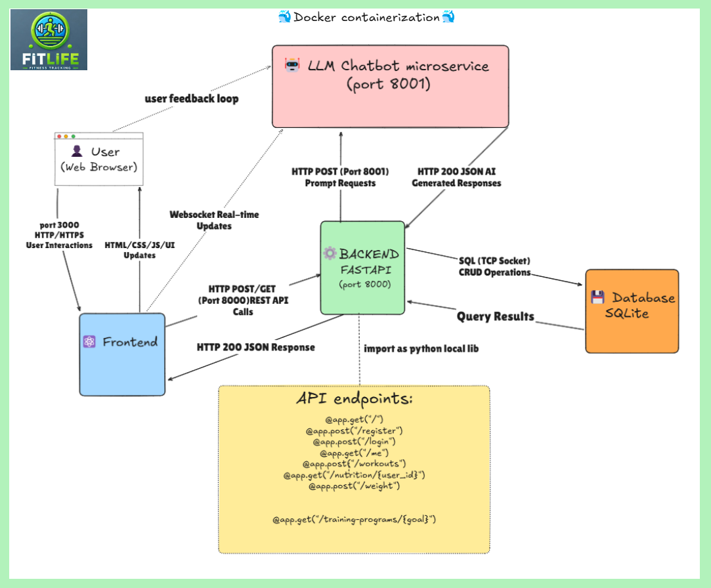
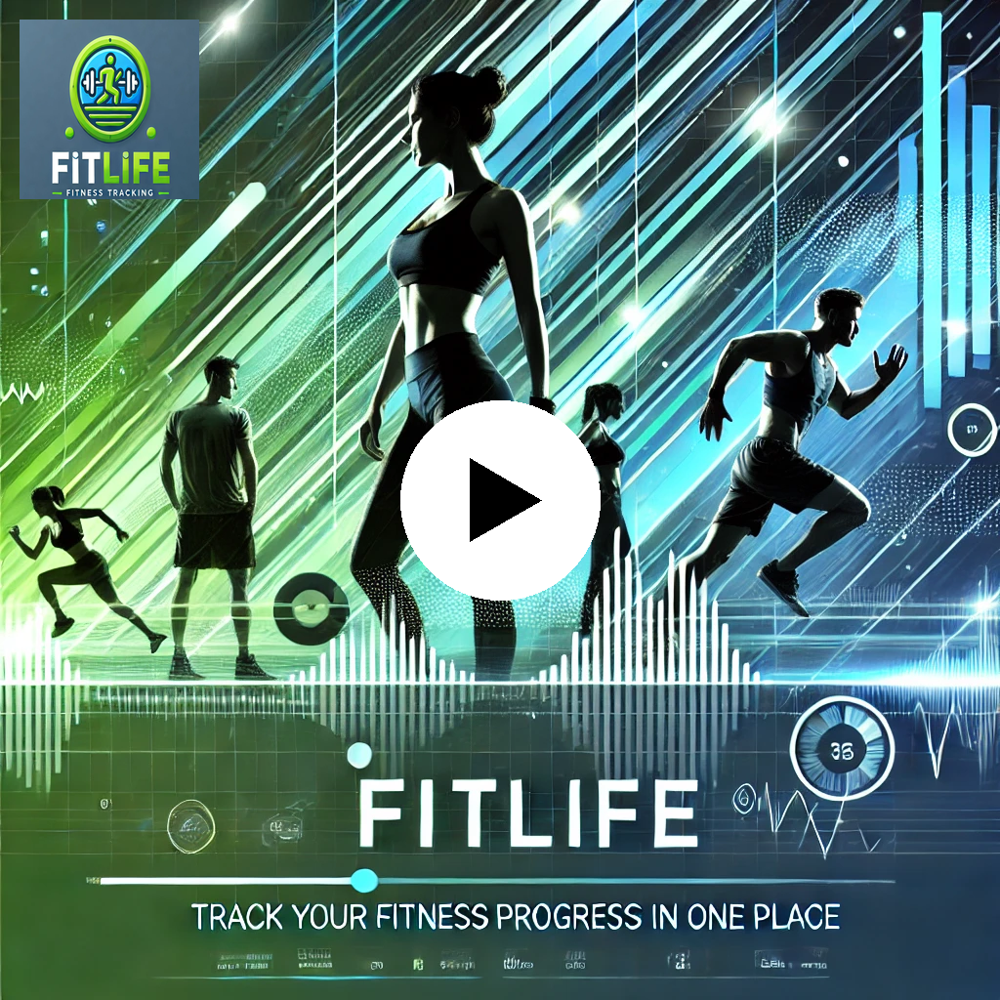

# 💪 FitLife - Fitness Tracking App

<div align="center">
 

 A comprehensive fitness and nutrition tracking system to help users achieve their health goals.

 [](https://fastapi.tiangolo.com)
 [](https://reactjs.org)
 [](https://docker.com)
 [](https://sqlite.org)
</div>

The **FitLife** application is a full-stack fitness tracking platform built with FastAPI and React. It offers personalized workout tracking, nutrition logging, weight monitoring, and AI-powered fitness advice. The backend is containerized with Docker for easy deployment, while the frontend provides an intuitive interface for visualizing fitness progress.

---

## 🚀 Features

- **User Authentication**: Secure JWT-based authentication with password hashing
- **Workout Tracking**: Log exercise routines with duration tracking
- **Nutrition Logs**: Track daily food intake with calorie counting and visual charts
- **Weight Monitoring**: Record weight changes over time with interactive graphs
- **Personalized Calorie Recommendations**: Get customized calorie recommendations based on physical attributes and fitness goals.
- **Downloadable Training Programs**: Access specialized workout plans (muscle building, weight loss, etc.)
- **AI Fitness Bot**: Get answers to fitness and nutrition questions powered by LLM technology

---

## 🗂️ Project Architecture

  


```

fitlife-app/
├── backend/               # FastAPI backend services
│   ├── app/
│   │   ├── api/           # API endpoints
│   │   ├── core/          # Core functionality
│   │   ├── models.py      # Database models/schemas
│   │   └── database.py    # Database connection
│   ├── LLM_CHATBOT/       # Fitness Bot microservice
│   ├── files/             # Training program PDFs
│   ├── tests/             # Test suites (unit tests and integration test)
│   ├── requirements.txt   # Python dependencies for backend
│   └── Dockerfile
|
├── frontend/              # React frontend
│   ├── public/
│   ├── src/
│   │   ├── _mocks_/       # Test mock data
│   │   ├── _tests_/       # Unit and integration tests
│   │   ├── assets/        # Static files (images, fonts)
│   │   ├── components/    # React components
│   │   ├── App.js         # Main application component
│   │   ├── index.js       # Application entry point
│   │   └── setupTests.js  # Test configuration
│   └── Dockerfile
|   ├── package-lock.json   # Locks dependencies to ensure consistent builds
|   ├── package.json        # Project metadata, scripts, and dependencies
└── docker-compose.yml     # Container orchestration
└── README.md             # Project documentation

```

---

## 🛠️ Setting Up the Project

### 1️⃣ Clone the Repository
```bash
git clone https://github.com/EASS-HIT-PART-A-2024-CLASS-VI/FITLIFE-fitness-tracking-ofir-cohen.git
cd FITLIFE-fitness-tracking-ofir-cohen
```

## 2️⃣ Environment Configuration
For the LLM Chatbot functionality (and more necessary environment variables for the project) you'll need to configure environment variables by following these steps:
1. Visit [MISTRAL AI ](https://console.mistral.ai/) to obtain your API key.
2. Create a `.env.example` file in the `backend` directory with:

```
VARIABLE_1=your_value  # for api key
VARIABLE_2=your_value  # for db url
VARIABLE_3=your_value  # for secret key to db
```


Copy the example file and replace with actual values:

  ```bash

cp backend/.env.example backend/.env
   ```

Update the values in your .env file:

```
MISTRAL_API_KEY=your_api_key 
DATABASE_URL=db_url
SECRET_KEY=your_secret_key

```
(while inside the backend dir)load environment variables from the .env file:

  ```bash
export $(cat .env | xargs)
echo 'MISTRAL_API_KEY=<YOUR_API_KEY>' 
```
### 3️⃣ Start the Application
  ```bash


docker-compose up --build
```


## 📚 Backend API

### 🔐 Authentication
- **POST /register**: Register a new user
- **POST /login**: Authenticate and receive JWT
- **GET /me**: Get current user details

### 💪 Workouts
- **POST /workouts**: Log a workout
- **GET /workouts/{user_id}**: Retrieve workouts by date

### 🥗 Nutrition
- **POST /nutrition**: Add food and calories
- **GET /nutrition/{user_id}**: Get nutrition history

### ⚖️ Weight
- **POST /weight**: Log weight measurement
- **GET /weight/{user_id}**: Retrieve weight history

### 📊 Recommendations
- **GET /recommended-calories**: Get personalized calorie targets

### 📑 Training Programs
- **GET /training-programs**: List available programs
- **GET /training-programs/{goal}**: Download specific program PDF

### 🤖 Fitness Bot
- **POST /chatbot**: Ask fitness and nutrition questions

## 🖥️ Frontend

The React frontend provides an intuitive interface for accessing all FitLife features:

### **Login/Registration**
Secure user authentication with JWT tokens and password protection

### **Workout Tracker**
Log exercise routines with duration tracking and history views

### **Nutrition Tracker**
Food logging with calorie visualization and nutritional breakdown charts

### **Weight Tracker**
Weight progress charts with time filtering (7/30/90 days and custom ranges)

### **Calorie Recommendations**
Personalized calorie targets based on height, weight, activity level and goals

### **Training Programs**
Download specialized workout plans for different fitness objectives

### **Fitness Bot**
AI-powered fitness assistant for nutrition and exercise guidance

## 🤖 LLM Chatbot Microservice

The FitLife application features an advanced AI-powered fitness assistant built on Mistral AI technology, implemented as a dedicated microservice:

### **Mistral AI Integration**
- **Mistral 7B Foundation Model**: Leverages the powerful open-source large language model optimized for conversational applications
- **Context-Aware Processing**: Utilizes Mistral's advanced attention mechanisms for improved understanding of fitness-related queries
- **Efficient Inference**: Optimized for low-latency responses even with limited computational resources
- **Instruction-Tuned**: Fine-tuned specifically for fitness domain knowledge and conversational interactions

### **Architecture**
- **Isolated Service**: Runs as an independent microservice for better scalability and resource allocation
- **RESTful API**: Exposes endpoints for query submission and response retrieval
- **Containerized Deployment**: Self-contained Docker image with Mistral runtime dependencies
- **Stateless Design**: Maintains conversation history through client-side session management

### **Key Features**
- **Domain-Specific Knowledge**: Extensive fitness, nutrition, and wellness information
- **Personalized Guidance**: Tailors responses based on user profiles and fitness objectives
- **Multi-turn Conversations**: Maintains context across multiple exchanges for natural interaction
- **Evidence-Based Responses**: Provides scientifically-backed fitness and nutrition information

### **Technical Implementation**
- **FastAPI Backend**: High-performance asynchronous framework for API endpoints
- **Quantized Model**: 4-bit quantization for efficient deployment without significant accuracy loss
- **Response Templating**: Structured output formatting for consistent user experience
- **Security-First Design**: API key authentication and request validation

### **Environment Configuration**
- **MISTRAL_API_KEY**: Authentication token for Mistral AI API access
- **MODEL_VERSION**: Configurable model version selection
- **TEMPERATURE**: Adjustable response creativity parameter
- **MAX_TOKENS**: Configurable response length limits
- **CONTEXT_WINDOW**: Adjustable conversation history retention

### **Example Capabilities**
- Exercise form guidance with biomechanical understanding
- Nutritional advice based on dietary preferences and restrictions
- Recovery strategies based on training intensity and frequency
- Goal-specific fitness tracking recommendations

## 💾 Database Design

FitLife uses SQLite as its database solution, providing a lightweight yet powerful data persistence layer:

### **Database Schemas**
- **Users Table**: Stores user profiles, authentication details, and personal metrics
- **Workouts Table**: Records exercise sessions with duration, type, and date information
- **Nutrition Logs**: Tracks food intake with calorie and nutritional information
- **Weight Logs**: Stores weight measurements over time for progress tracking
- **Training Programs**: References to downloadable fitness program PDFs

### **Key Relationships**
- One-to-many relationship between users and workout logs
- One-to-many relationship between users and nutrition entries
- One-to-many relationship between users and weight measurements

### **Data Access Layer**
- **SQLAlchemy ORM**: Provides object-relational mapping for database operations
- **Pydantic Models**: Ensures data validation and type safety
- **Migration Support**: Database schema can evolve with application requirements

### **Performance Considerations**
- Optimized query patterns for frequent operations
- Indexed fields for faster lookups (user_id, dates)
- Efficient storage of time-series data for analytics
- Minimal redundancy in the database schema

### **Data Security**
- Password hashing with bcrypt
- No storage of plaintext sensitive information
- Row-level access control based on user authentication

 ## Port Configuration

### Frontend
- **Port:** 3000
- **URL:** http://localhost:3000

### Backend API
- **Port:** 8000
- **URL:** http://localhost:8000
- **Swagger UI**: http://localhost:8000/docs


### LLM Chatbot
- **Port:** 8001
- **URL:** http://localhost:8001
- **Swagger UI**: http://localhost:8001/docs


## 🧪 Testing

### **Backend Tests**
#### Unit Tests
- Test individual endpoints and internal logic without external dependencies:
  ```bash
  pytest tests/unit_tests.py
  ```

#### Integration Tests
- Test the system as a whole, including interactions with external services:
  ```bash
  pytest tests/integration_test.py
  ```
### Frontend tests
  ```bash
   cd frontend
   npm test
  ```


## 🔧 Technologies Used

### **Backend**
- **FastAPI:** Modern, high-performance web framework
- **SQLite:** Lightweight database for data persistence
- **SQLAlchemy:** SQL toolkit and ORM
- **Pydantic:** Data validation and settings management
- **JWT:** Secure authentication
- **Docker:** Containerization for deployment

### **Frontend**  
- **React:** JavaScript library for building user interfaces
- **Chart.js:** Interactive data visualization
- **Axios:** HTTP client for API requests
- **Bootstrap:** Responsive UI components
- **Tailwind CSS**: Utility-first styling
- **Jest & React Testing Library**: Testing

  ### **AI & Intelligence**
- **Mistral AI 7B:** Advanced large language model fine-tuned on fitness and nutrition 
- **NLP Domain Adaptation:** Specialized understanding of exercise terminology and nutritional concepts
- **Knowledge-Grounded AI:** Evidence-based recommendations aligned with fitness best practices

  ### **Data Storage Service**
- **SQLite & SQLAlchemy:** Efficient ORM-based data persistence
- **Migration Framework:** Seamless schema evolution and versioning
- **Query Optimization:** Indexed fields and efficient query patterns
- **Data Integrity:** Referential constraints and validation rules

### **Deployment & Infrastructure**
- **Docker**: Containerization
- **Docker Compose:** Multi-container orchestration
- **GitHub Actions**: Version Control Workflow
- **Modular Architecture:** Scalable microservices design

---

## 🎬 Demo

Click here to watch the demo video:

<p align="center">
  <a href="https://youtu.be/0C77g-xDIg8">
    
  </a>
</p>

## 👨‍💻 Author

- **Name:** Ofir Cohen  
- **Email:** ofircohen599@gmail.com
- **GitHub:** [ofiz](https://github.com/ofiz)
